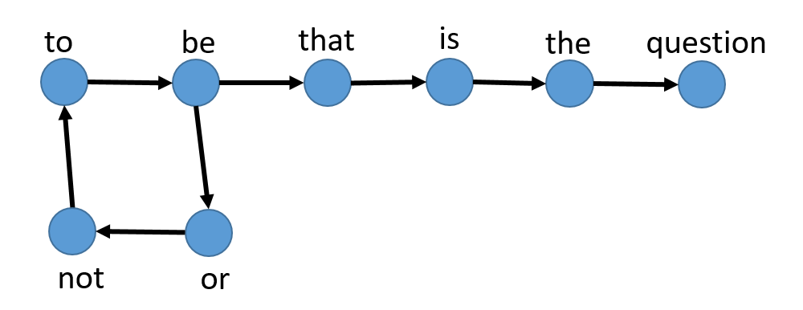

# Subgraph Frequencies
subgraph-frequencies v1.0

Code that calculates the frequencies of all directed subgraphs involving three nodes from a directed network as described in http://ieeexplore.ieee.org/document/7839612/

## Requirements

igraph - http://igraph.org/python/  
Python 3


## Usage

Calculate the frequencies of all directed subgraphs from the directed network in the input file:

```
python get_frequencies.py -a input.paj
```

## Options

```
Usage: python get_frequencies.py -a|-r <networkfile>
Options:
  -a             It returns the absolute frequency of all subgraphs (i.e. raw count).
  -r             It returns the relative frequency of all subgraphs.

Input:
  <networkfile>  Network file in the PAJEK format.

```

## Example

Consider the following co-occurrence network (the nodes represent the words and the arcs connect adjacent words) obtained from the text sample 'to be or not to be that is the question':



One PAJEK file that represents this network is presented below:

```
*Vertices 8
1 "to"
2 "be"
3 "or"
4 "not"
5 "that"
6 "is"
7 "the"
8 "question"
*Arcs
1 2
2 3
3 4
4 1
2 5
5 6
6 7
7 8
```

The frequencies of all directed subgraphs with three nodes from the above network are:

For -a: [0, 8, 0, 1, 0, 0, 0, 0, 0, 0, 0, 0, 0]

For -r: [0.0, 0.88888, 0.0, 0.11111, 0.0, 0.0, 0.0, 0.0, 0.0, 0.0, 0.0, 0.0, 0.0]

Each value in the output array corresponds to the frequency of one subgraph, according to the mapping below:

